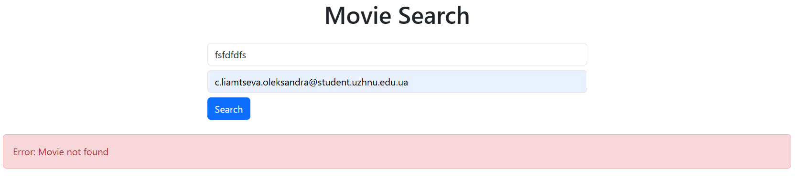
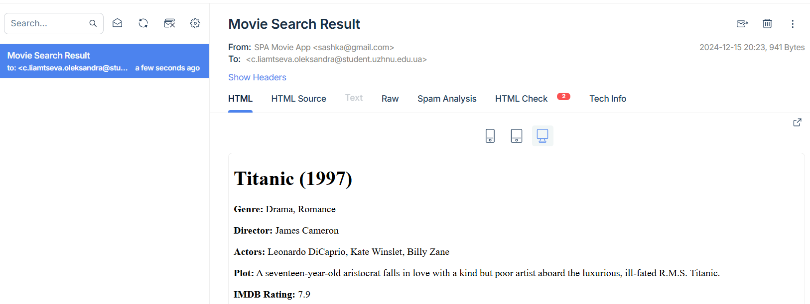
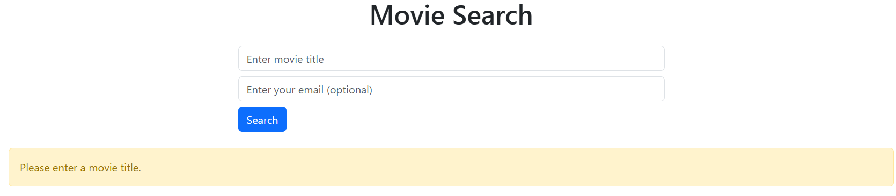

# 🎬 Movie Search Application

This project allows users to search for movies by title via the OMDB API, view detailed information about the movie, and optionally receive the results via email. 📧

## Usage 💡

1. Enter a movie title in the "Enter movie title" field. 🎬
2. Optionally, enter your email address in the "Enter your email" field. 📧
3. Click the "Search" button to get movie details. 🔍

4. If the movie is found, the details will be displayed on the screen. 🖥️

5. If you provided an email address, the results will be sent to your email. 📩

6. Validation:

## Technologies 🛠️

- **Backend**: Laravel (PHP) 🖥️
- **Frontend**: HTML, CSS (Bootstrap), JavaScript (Fetch API) 💻
- **API**: OMDB API for fetching movie data 🎥
- **Email**: Laravel Mail for sending the search results via email ✉️
## Features 🚀

1. **Search for Movies**: Users can enter a movie title to search. 🔍
2. **Movie Details**: The application fetches detailed information about the movie from the OMDB API. 📄
3. **Movie Information**: If the movie is found, users can view:
    - Movie title 🎥
    - Year of release 📅
    - Genre 🎭
    - Director 🎬
    - Actors 🎭
    - Plot 📖
    - IMDB rating ⭐
4. **Email Option**: Users can optionally enter their email address to receive the search result via email. 📧
5. **Email Notifications**: The search result is sent to the provided email address. 📩

## Contact 📬

If you have any questions or suggestions, feel free to contact us:

- **Email**: c.liamtseva.oleksandra@student.uzhnu.edu.ua ✉️

